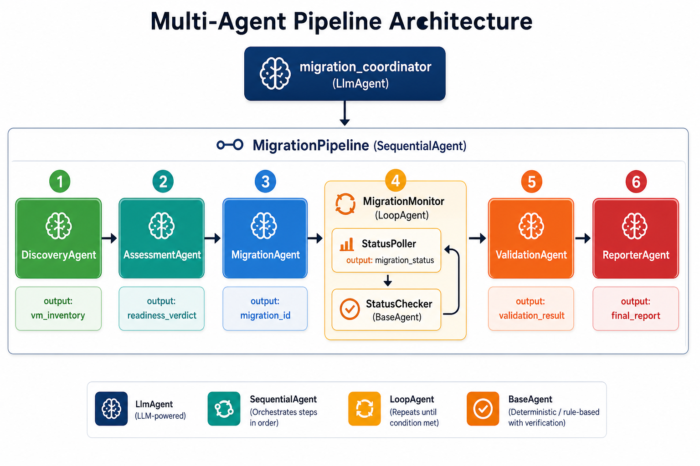
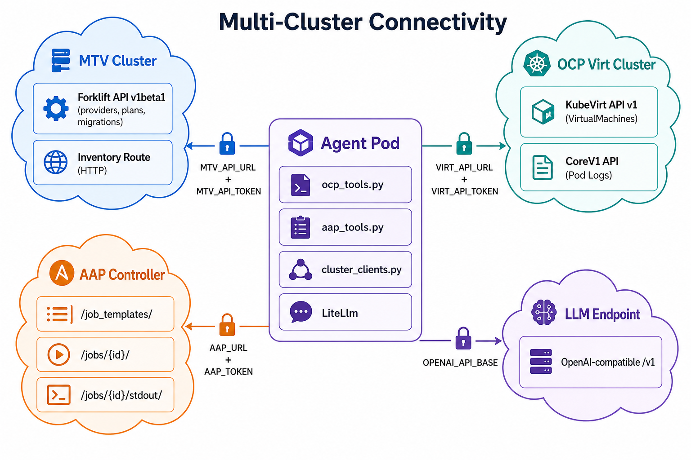

# gadk-rhoai

AI-powered VMware-to-OpenShift Virtualization migration agent built with [Google ADK](https://github.com/google/adk-python), deployed on OpenShift with OIDC auth, LLM flexibility, and configurable skills.

## What It Does

An intelligent migration coordinator that can:
- **Assess migration readiness** by analyzing Ansible playbook output (36 pre-migration checks)
- **Execute migrations** by triggering MTV (Migration Toolkit for Virtualization) plans
- **Monitor migrations** in real-time with log analysis and failure diagnosis
- **Validate post-migration** results (39 post-migration checks, before/after comparison)
- **Generate reports** with structured findings, blockers, and remediation steps
- **Plan migration batches** with capacity analysis and risk assessment

## Architecture





For detailed architecture documentation with 5 diagrams (deployment, agent pipeline, multi-cluster connectivity, tool/skill matrix, and data flow), see **[docs/architecture.md](docs/architecture.md)**.

### Multi-Agent Pipeline (AGENT_MODE=pipeline)

```
Coordinator (root_agent)
  |-- MigrationPipeline (SequentialAgent)
  |     |-- DiscoveryAgent      -> list VMware VMs
  |     |-- AssessmentAgent     -> run pre-migration checks, produce readiness report
  |     |-- MigrationAgent      -> trigger MTV migration
  |     |-- MigrationMonitor    -> poll status until complete (LoopAgent)
  |     |-- ValidationAgent     -> run post-migration checks, compare before/after
  |     |-- ReporterAgent       -> generate completion report
  |-- (direct tools for ad-hoc queries)
```

### Single-pod Sidecar Pattern (OpenShift)

- `adk-web` container: nginx serving Angular UI + proxying `/api/` to localhost:8000
- `adk-api` container: `adk api_server` running the migration agent
- Init container: reconstructs skill directory tree from ConfigMap

## Skills

| Skill | Description |
|---|---|
| `pre-migration-analyzer` | 36 checks from customer's pre-migration playbook (hypervisor, OS, kernel, disk, packages, backup, CMDB) |
| `post-migration-validator` | 39 checks from customer's post-migration playbook (platform, ACM, vCenter cleanup, guest agent, CMDB) |
| `ansible-output-parser` | Parses AAP job output format (Slice headers, assertions, ignored errors, PLAY RECAP) |
| `assessment-report-generator` | Formal readiness report with per-check table, blockers, warnings, remediation |
| `completion-report-generator` | Migration completion report with before/after comparison and sign-off |
| `mtv-log-analyzer` | Diagnoses MTV migration failures from forklift/virt-v2v/CDI logs |
| `migration-kb-builder` | Manages knowledge base of migration patterns and resolutions |
| `capacity-analyzer` | Cluster capacity analysis for migration planning |
| `batch-planner` | Groups VMs into migration batches by risk, dependency, and capacity |
| `risk-assessor` | Weighted risk scoring (OS, disk, network, criticality, backup, history) |
| `migration-workflow` | End-to-end orchestration: discover, assess, migrate, monitor, validate, report |

Skills include bundled sample data from real customer playbook output for offline demos.

## Tools

| Tool | Source | Description |
|---|---|---|
| `list_vmware_vms` | MTV inventory API | Discover VMware VMs via Forklift provider |
| `list_migrated_vms` | KubeVirt API | List VMs on OCP Virtualization |
| `get_vm_details` | KubeVirt API | Detailed VM spec (CPU, memory, disks, interfaces) |
| `get_migration_status` | Forklift API | Check MTV plan/migration progress |
| `create_migration_plan` | Forklift API | Trigger a real VMware-to-OCP Virt migration |
| `get_pod_logs` | Kubernetes API | Read pod logs for troubleshooting |
| `list_job_templates` | AAP API | List available Ansible job templates |
| `launch_job` | AAP API | Trigger an Ansible playbook via AAP |
| `get_job_status` | AAP API | Poll Ansible job progress |
| `get_job_output` | AAP API | Retrieve playbook stdout output |
| `save_report_artifact` | ADK Artifacts | Save report as downloadable file |

## Pre-Built Images

| Image | Description |
|---|---|
| `quay.io/rbrhssa/adk-web:oidc` | ADK Web UI with OIDC auth support (nginx) |
| `quay.io/rbrhssa/adk-agent:migration` | Migration agent with all skills and sample data |

## Quick Start

```bash
# 1. Create namespace
oc new-project adk-web

# 2. Create image pull secret (if images are private)
oc create secret docker-registry quay-pull-secret \
  --docker-server=quay.io \
  --docker-username=YOUR_QUAY_USER \
  --docker-password=YOUR_QUAY_PASS

# 3. Create cluster access tokens (for multi-cluster)
oc create secret generic mtv-cluster-token --from-literal=token=<MTV_TOKEN> -n adk-web
oc create secret generic virt-cluster-token --from-literal=token=<VIRT_TOKEN> -n adk-web
oc create secret generic aap-agent-token --from-literal=token=<AAP_TOKEN> -n adk-web

# 4. Edit deploy/openshift.yaml -- replace placeholders:
#    KEYCLOAK_HOST, REALM_NAME, CLIENT_ID
#    LLM_API_BASE, ADK_MODEL_NAME

# 5. Deploy
oc apply -f deploy/openshift.yaml

# 6. Get the URL
oc get route adk-web -o jsonpath='{.spec.host}'
```

## Configuration

### Agent Environment Variables

| Env Var | Default | Description |
|---|---|---|
| `OPENAI_API_BASE` | - | LLM API endpoint |
| `ADK_MODEL` | `openai/gemini/models/gemini-2.5-flash` | LiteLlm model string |
| `AGENT_MODE` | `pipeline` | `pipeline` (multi-agent) or `single` (monolithic) |
| `SKILLS_DIR` | `/skills` | Skills directory path |
| `DEFAULT_MTV_NAMESPACE` | `mtv-user1` | MTV provider namespace |
| `DEFAULT_VIRT_NAMESPACE` | `vmimported-user1` | Target namespace for migrated VMs |
| `AAP_URL` | - | AAP Controller URL |
| `AAP_TOKEN` | *(from Secret)* | AAP API bearer token |
| `PRE_MIGRATION_TEMPLATE_ID` | - | AAP template ID for pre-migration assessment |
| `POST_MIGRATION_TEMPLATE_ID` | - | AAP template ID for post-migration validation |

See `deploy/openshift.yaml` for the full list including multi-cluster configuration.

## Test Prompts

See [docs/test-prompts.md](docs/test-prompts.md) for categorized test prompts covering all four use cases:
1. Migration readiness assessment
2. Migration monitoring and troubleshooting
3. Post-migration validation
4. Migration planning and capacity insights

## Disconnected / Air-Gapped Deployment

This agent can run in a fully disconnected environment with no external internet access at runtime.

### Container Images to Mirror

Pull these images into your mirror registry before deployment:

| Image | Purpose |
|---|---|
| `quay.io/rbrhssa/adk-web:oidc` | Angular UI + nginx reverse proxy |
| `quay.io/rbrhssa/adk-agent:migration` | Agent with all skills and sample data baked in |
| `docker.io/library/busybox:latest` | Init container for skill directory setup |

If rebuilding the agent image locally, you also need `python:3.11-slim` as the base.

### Python Packages (for Local Builds Only)

Pre-download all packages and their transitive dependencies:

```bash
pip download -d ./wheels \
  "google-adk>=1.0.0,<2.0.0" litellm python-dotenv \
  requests kubernetes tenacity

# Transfer ./wheels to the disconnected build host, then:
pip install --no-cache-dir --no-index --find-links=./wheels \
  "google-adk>=1.0.0,<2.0.0" litellm python-dotenv \
  requests kubernetes tenacity
```

### LLM Requirement

The agent requires an **OpenAI-compatible LLM endpoint** reachable from the cluster. No external API calls are needed if you host the model locally:

| Option | Notes |
|---|---|
| **Ollama** | `OPENAI_API_BASE=http://ollama-svc:11434/v1` |
| **vLLM** | `OPENAI_API_BASE=http://vllm-svc:8000/v1` |
| **TGI** (Text Generation Inference) | `OPENAI_API_BASE=http://tgi-svc:8080/v1` |
| **Llama Stack** on OpenShift AI | `OPENAI_API_BASE=https://llamastack-svc/v1` |

Set `OPENAI_API_KEY=not-needed` for local models that don't require authentication.

### Cluster Prerequisites

| Requirement | Minimum Version | Purpose |
|---|---|---|
| **OpenShift** | 4.14+ | Container platform |
| **OCP Virtualization** | 4.14+ | Target platform for migrated VMs |
| **Migration Toolkit for Virtualization (MTV)** | 2.5+ | VMware-to-OCP Virt migration engine |
| **VMware vSphere** | 7.0+ | Source hypervisor (configured as MTV provider) |
| **Storage** | ODF or equivalent | StorageClass for VM disk PVCs |
| **Keycloak** (optional) | -- | OIDC authentication for the UI |
| **Ansible Automation Platform** (optional) | 2.4+ | Pre/post migration playbook execution |

### Network Requirements (Disconnected)

The agent pod requires network access only to internal services:

| Destination | Port | Purpose |
|---|---|---|
| MTV cluster API server | 6443 | Forklift provider/plan/migration CRs |
| OCP Virt cluster API server | 6443 | KubeVirt VM CRs, pod logs |
| LLM endpoint | varies | Model inference |
| AAP Controller (if used) | 443 | Ansible job execution |
| Mirror registry | 443/5000 | Image pulls |

No external internet access is required at runtime. All skills and sample data are baked into the agent container image.

## Building Images

```bash
# Build the agent image
cd /path/to/gadk-rhoai
podman build --platform linux/amd64 -f deploy/Dockerfile.agent -t adk-agent:migration .
podman push quay.io/rbrhssa/adk-agent:migration

# Redeploy (no image rebuild needed for skill-only changes via ConfigMap)
oc rollout restart deployment/adk-web -n adk-web
```

## License

Apache License 2.0. See [LICENSE](LICENSE).

Agent code uses [google-adk](https://github.com/google/adk-python) (Apache 2.0).
UI uses [adk-web](https://github.com/google/adk-web) (Apache 2.0).
