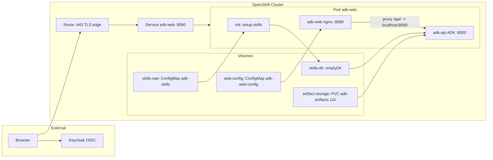
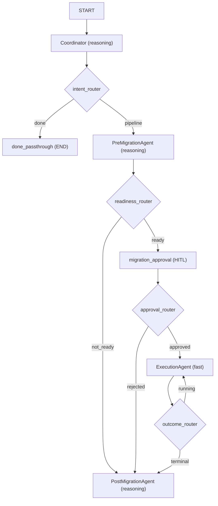
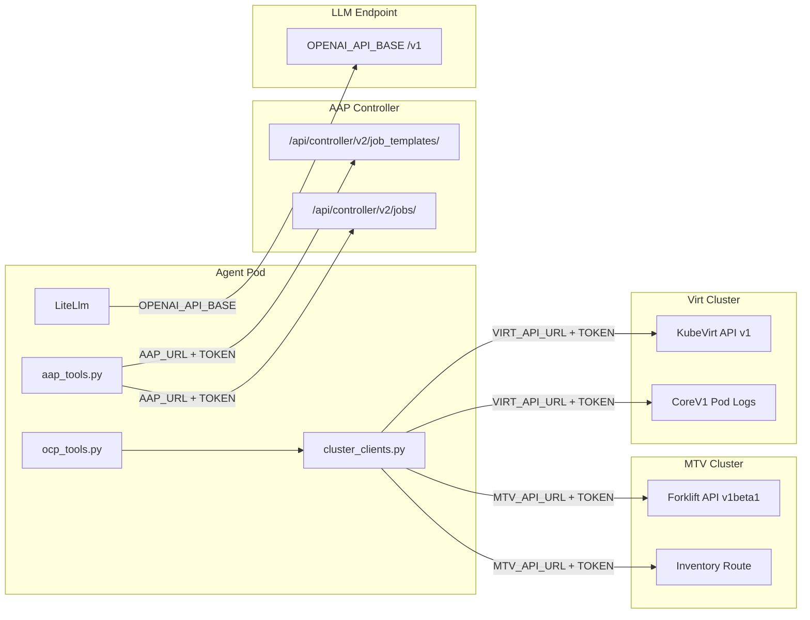
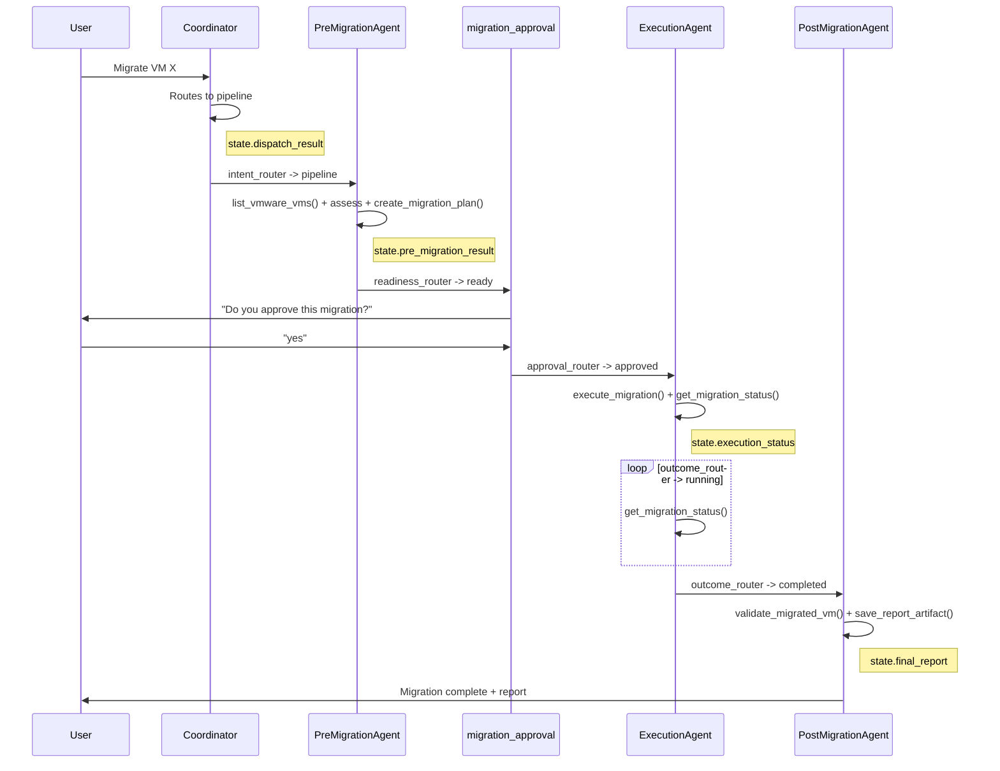

# Architecture

Detailed architecture documentation for the OCP Virt Migration Agent. Every diagram is traced from the actual source code. Each section includes a colorful reference image and an editable Mermaid diagram.

---

## 1. OpenShift Deployment Architecture

How the agent is deployed on OpenShift as a single pod with a sidecar pattern.

**Source**: [`deploy/openshift.yaml`](../deploy/openshift.yaml), [`deploy/nginx.conf`](../deploy/nginx.conf), [`deploy/Dockerfile.agent`](../deploy/Dockerfile.agent)

The pod uses a **sidecar pattern** with two containers sharing `localhost`:

| Container | Image | Port | Role |
|---|---|---|---|
| `adk-web` | `quay.io/rbrhssa/adk-web:oidc` | 8080 | nginx serving Angular UI, proxying `/api/` to `localhost:8000` |
| `adk-api` | `quay.io/rbrhssa/adk-agent:migration` | 8000 | ADK API server running the migration agent |
| init: `setup-skills` | `busybox` | -- | Reconstructs skill directory tree from ConfigMap keys |

**Network path**: Route (TLS edge :443) -> Service `adk-web` (:8080) -> nginx -> `proxy_pass http://localhost:8000/`

Only port 8080 is on the Service and Route. The API on 8000 is internal to the pod.

**Volumes**:

| Volume Name | Type | Source | Mounted To | Purpose |
|---|---|---|---|---|
| `web-config` | ConfigMap | `adk-web-config` | nginx at `runtime-config.json` | UI config (backend URL, OIDC) |
| `skills-raw` | ConfigMap | `adk-skills` | init at `/skills-raw` | Agent instruction override |
| `skills-dir` | emptyDir | -- | init writes `/skills`, `adk-api` reads `/skills` | Skill directory |
| `artifact-storage` | PVC (1Gi) | `adk-artifacts` | `adk-api` at `/app/.adk` | Saved report artifacts |

**Secrets**:

| Secret | Env Var | Optional? | Purpose |
|---|---|---|---|
| `quay-pull-secret` | imagePullSecrets | No (required for image pull) | Pull container images from Quay |
| `mtv-cluster-token` | `MTV_API_TOKEN` | Yes | Authenticate to remote MTV cluster |
| `virt-cluster-token` | `VIRT_API_TOKEN` | Yes | Authenticate to remote OCP Virt cluster |
| `aap-agent-token` | `AAP_TOKEN` | Yes | Authenticate to AAP Controller |

Mermaid source (editable)

---

## 2. Multi-Agent Pipeline Architecture

The agent uses an ADK 2.0 Workflow graph with 4 specialized agents, modeled after Google's official [Ambient Expense Agent](https://github.com/google/adk-samples/tree/main/python/agents/ambient-expense-agent) (graph + HITL) and [Small Business Loan Agent](https://github.com/google/adk-samples/tree/main/python/agents/small-business-loan-agent) (orchestrator + sub-agents).

**Source**: [`app/agent.py`](../app/agent.py) `_build_workflow()`

When `AGENT_MODE=pipeline` (default), the root agent is an ADK 2.0 **Workflow** graph with code-controlled edges, conditional routing, a monitoring loop, and native HITL:

| Agent | `output_key` | Model Tier | Tools |
|---|---|---|---|
| `Coordinator` | `dispatch_result` | reasoning | ALL tools + SkillToolset (handles ad-hoc queries + dispatches pipeline) |
| `PreMigrationAgent` | `pre_migration_result` | reasoning | `list_vmware_vms`, `get_vm_details`, `check_cluster_readiness`, `create_migration_plan`, `launch_job`, `get_job_status`, `get_job_output`, SkillToolset |
| `ExecutionAgent` | `execution_status` | fast | `execute_migration`, `get_migration_status`, `get_pod_logs`, SkillToolset |
| `PostMigrationAgent` | `final_report` | reasoning | `validate_migrated_vm`, `list_migrated_vms`, `get_vm_details`, `rollback_migration`, `save_report_artifact`, `record_migration`, `launch_job`, `get_job_status`, `get_job_output`, SkillToolset |

The **Coordinator** handles ~93% of interactions (ad-hoc queries) directly. Only explicit migration requests trigger the pipeline.

When `AGENT_MODE=single`, a single monolithic `LlmAgent` with all tools replaces the graph.

Mermaid source (editable)

---

## 3. Multi-Cluster Connectivity

The agent connects to up to 4 external systems, each with independent authentication.

**Source**: [`agent/app/cluster_clients.py`](../agent/app/cluster_clients.py), [`agent/app/ocp_tools.py`](../agent/app/ocp_tools.py), [`agent/app/aap_tools.py`](../agent/app/aap_tools.py)

### Connection Details

| Target | Auth Env Vars | API | Used By |
|---|---|---|---|
| **MTV Cluster** | `MTV_API_URL` + `MTV_API_TOKEN` | Forklift `v1beta1` (providers, plans, migrations, networkmaps, storagemaps) + Inventory Route HTTP | `list_vmware_vms`, `get_migration_status`, `create_migration_plan` |
| **Virt Cluster** | `VIRT_API_URL` + `VIRT_API_TOKEN` (falls back to MTV) | KubeVirt `v1` (VirtualMachines) + CoreV1 (pod logs) | `list_migrated_vms`, `get_vm_details`, `get_pod_logs` |
| **AAP Controller** | `AAP_URL` + `AAP_TOKEN` | REST `/api/controller/v2/` (job_templates, jobs, stdout) | `list_job_templates`, `launch_job`, `get_job_status`, `get_job_output` |
| **LLM Endpoint** | `OPENAI_API_BASE` + `OPENAI_API_KEY` (consumed by LiteLLM, not in agent Python code) | OpenAI-compatible `/v1` | All LlmAgent instances via LiteLlm |

### Token Resolution

**MTV/Virt K8s API tokens** (`_read_token` in `cluster_clients.py`):

1. Read env var (e.g., `MTV_API_TOKEN`)
2. If the value is a file path (`os.path.isfile`), read the file contents instead
3. If no URL+token pair is configured, fall back to `load_incluster_config()` or `load_kube_config()`

**Forklift Inventory HTTP token** (`_get_inventory_token`):

1. Try `MTV_INVENTORY_TOKEN` env var (with file-path indirection)
2. Else try `MTV_API_TOKEN` env var (with file-path indirection)
3. Else fall back to in-cluster SA token at `/var/run/secrets/kubernetes.io/serviceaccount/token`

**AAP tokens** are read directly from the `AAP_TOKEN` env var (no file indirection, no SA fallback).

### TLS Verification

| Connection | CA Env Var | Default |
|---|---|---|
| MTV/Virt K8s API | `MTV_API_CA` / `VIRT_API_CA` | Skip verification if unset |
| Forklift Inventory HTTP | `OCP_CA_BUNDLE` | Skip verification if unset |
| AAP Controller | `AAP_CA_BUNDLE` | Skip verification if unset; `"true"` = use system CAs |

Mermaid source (editable)

---

## 4. Tool and Skill Access Matrix

Which tools and skills are available to each agent in the workflow.

**Source**: [`app/agent.py`](../app/agent.py) tool lists per agent

| Agent | list_vmware_vms | list_migrated_vms | get_migration_status | get_vm_details | create_migration_plan | execute_migration | validate_migrated_vm | get_pod_logs | rollback_migration | launch_job | get_job_status | get_job_output | save_report_artifact | record_migration | SkillToolset |
|---|---|---|---|---|---|---|---|---|---|---|---|---|---|---|---|
| **Coordinator** | Y | Y | Y | Y | Y | Y | Y | Y | Y | Y | Y | Y | Y | Y | Y |
| **PreMigrationAgent** | Y | | | Y | Y | | | | | Y | Y | Y | | | Y |
| **ExecutionAgent** | | | Y | | | Y | | Y | | | | | | | Y |
| **PostMigrationAgent** | | Y | | Y | | | Y | | Y | Y | Y | Y | Y | Y | Y |

The **SkillToolset** gives access to all 17 skills via `list_skills`, `load_skill`, and `load_skill_resource`. SkillToolset is only included when skills are discovered at startup. If `/skills` is empty or missing, agents will have no skill tools at runtime.

---

## 5. Data Flow Through the Pipeline

How session state accumulates as data flows through the workflow graph.

**Source**: `output_key=` on each agent in [`app/agent.py`](../app/agent.py)

Each agent writes its output to a session state key. Subsequent agents read from prior keys:

| Agent | Writes | Reads |
|---|---|---|
| Coordinator | `dispatch_result` | (user request) |
| PreMigrationAgent | `pre_migration_result` | `dispatch_result` (pipeline context) |
| ExecutionAgent | `execution_status` | `pre_migration_result` |
| PostMigrationAgent | `final_report` | all prior keys |

### Session State Key Payloads

| Key | Content |
|---|---|
| `dispatch_result` | Ad-hoc answer OR "PIPELINE: vm_name in namespace" trigger |
| `pre_migration_result` | VM inventory + readiness verdict + migration plan details (READY/NOT READY) |
| `execution_status` | Migration status: running / completed / failed with details |
| `final_report` | Markdown report: validation results OR rollback details OR assessment-only |

Mermaid source (editable)

