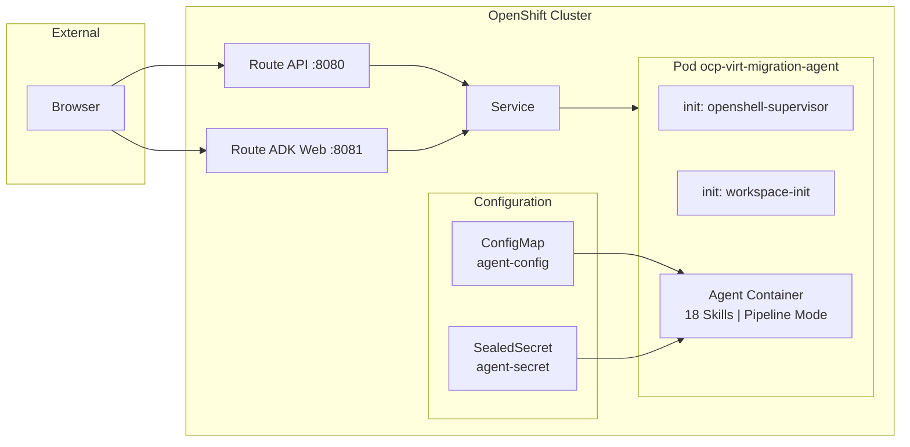
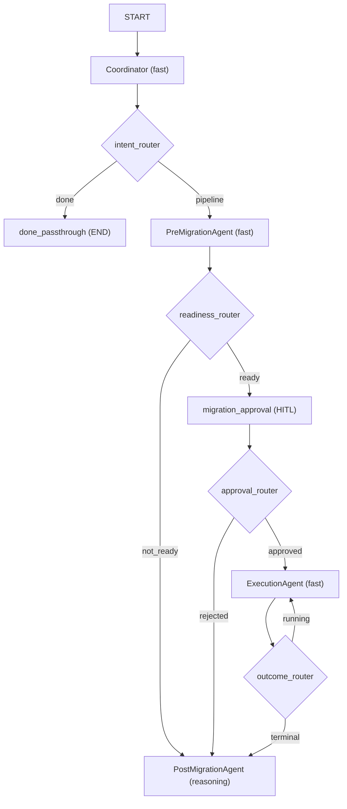
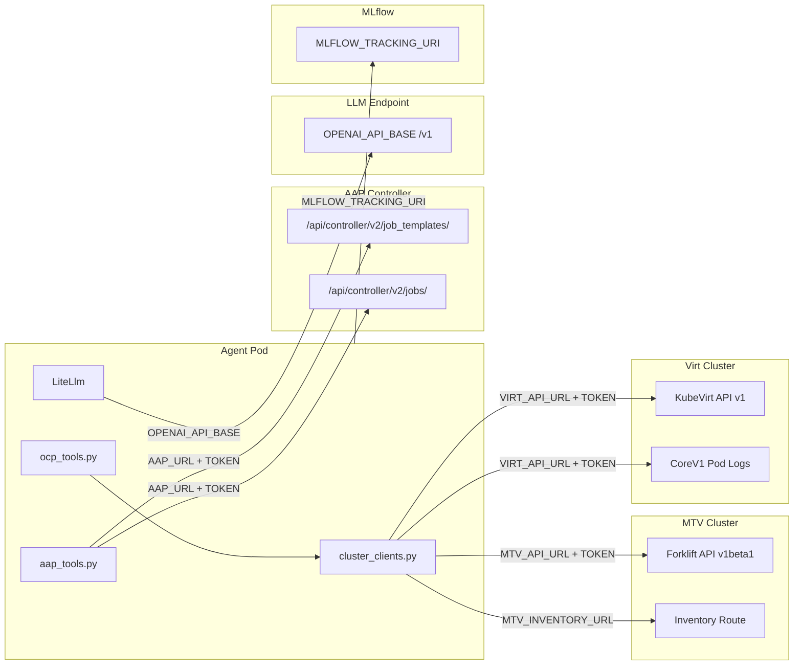

# Architecture

Detailed architecture documentation for the OCP Virt Migration Agent. Every diagram is traced from the actual source code. Each section includes a colorful reference image and an editable Mermaid diagram.

---

## 1. OpenShift Deployment Architecture

How the agent is deployed on OpenShift as a single pod in the OpenShell sandbox pattern.

**Source**: [`deploy/sandbox/sandbox.yaml`](../deploy/sandbox/sandbox.yaml), [`deploy/Dockerfile.agent`](../deploy/Dockerfile.agent), [`deploy/Containerfile.openshell`](../deploy/Containerfile.openshell)

The pod runs a single **agent container** with 18 skills baked into the image:

| Container | Image | Port | Role |
|---|---|---|---|
| `agent` | `ghcr.io/rrbanda/ocp-virt-migration-agent-sandbox:latest` | 8080, 8081 | Migration agent (API + ADK Web UI) |
| init: `openshell-supervisor-install` | `ghcr.io/nvidia/openshell/supervisor` | -- | OpenShell network supervisor |
| init: `workspace-init` | same as agent | -- | Copies skills and code to workspace |

**Network path**: Route (TLS edge :443) -> Service -> Agent Pod

Two Routes expose the agent:

| Route | Port | Purpose |
|---|---|---|
| `ocp-virt-migration-agent` | 8080 | Agent API (`/chat/completions`, `/health`, `/ui`) |
| `ocp-virt-migration-agent-openai` | 8081 | Google ADK Web UI (development/debug interface) |

**Configuration**:

| Resource | Name | Purpose |
|---|---|---|
| ConfigMap | `ocp-virt-migration-agent-config` | Agent instructions, model tiers, temperature settings |
| SealedSecret | `ocp-virt-migration-agent-secret` | `mtv-api-token`, `gemini-api-key`, `openai-api-key` |
| Skills | `/skills` (baked in image) | 18 skills for migration knowledge and workflows |

Mermaid source (editable)

---

## 2. Multi-Agent Pipeline Architecture

The agent uses an ADK 2.0 Workflow graph with 4 specialized agents, conditional routing, a monitoring loop, and native HITL (Human-in-the-Loop) approval.

**Source**: [`app/agent.py`](../app/agent.py) `_build_workflow()`

When `AGENT_MODE=pipeline` (default), the root agent is an ADK 2.0 **Workflow** graph:

| Agent | `output_key` | Model Tier | Tools |
|---|---|---|---|
| `Coordinator` | `dispatch_result` | fast | ALL 15 tools + SkillToolset (handles ~93% ad-hoc queries + dispatches pipeline) |
| `PreMigrationAgent` | `pre_migration_result` | fast | `list_vmware_vms`, `get_vm_details`, `check_cluster_readiness`, `create_migration_plan`, `launch_job`, `get_job_status`, `get_job_output`, SkillToolset |
| `ExecutionAgent` | `execution_status` | fast | `execute_migration`, `get_migration_status`, `get_pod_logs`, SkillToolset |
| `PostMigrationAgent` | `final_report` | reasoning | `validate_migrated_vm`, `list_migrated_vms`, `get_vm_details`, `rollback_migration`, `save_report_artifact`, `record_migration`, `launch_job`, `get_job_status`, `get_job_output`, SkillToolset |

The **Coordinator** handles most interactions (ad-hoc queries) directly. Only explicit migration requests (e.g., "migrate database-user1") trigger the full pipeline via the `PIPELINE:` keyword.

When `AGENT_MODE=single`, a single monolithic `LlmAgent` with all tools replaces the graph.

### Safety Features

- **HITL approval gate**: Migration cannot proceed without explicit human approval
- **`require_confirmation=True`**: Destructive tools (`create_migration_plan`, `rollback_migration`) require confirmation in ad-hoc mode
- **`migration_safety_callback`**: Enforces dry-run gate (`MIGRATION_DRY_RUN`) on all destructive tools
- **Stale CR cleanup**: `_cleanup_stale_plan()` automatically deletes terminal-state CRs before re-creation
- **Monitoring budget**: `MAX_MONITOR_POLLS=90` with explicit 20-30s polling cadence

Mermaid source (editable)

---

## 3. Multi-Cluster Connectivity

The agent connects to up to 5 external systems, each with independent authentication.

**Source**: [`app/shared/cluster_clients.py`](../app/shared/cluster_clients.py), [`app/tools/ocp_tools.py`](../app/tools/ocp_tools.py), [`app/tools/aap_tools.py`](../app/tools/aap_tools.py)

### Connection Details

| Target | Auth Env Vars | API | Used By |
|---|---|---|---|
| **MTV Cluster** | `MTV_API_URL` + `MTV_API_TOKEN` | Forklift `v1beta1` (providers, plans, migrations, networkmaps, storagemaps) | `list_vmware_vms`, `get_migration_status`, `create_migration_plan`, `execute_migration` |
| **MTV Inventory** | `MTV_INVENTORY_URL` + `MTV_API_TOKEN` | Inventory Route HTTP `/providers/vsphere/{uid}/vms` | `list_vmware_vms`, `create_migration_plan` (VM lookup) |
| **Virt Cluster** | `VIRT_API_URL` + `VIRT_API_TOKEN` (falls back to MTV) | KubeVirt `v1` (VirtualMachines) + CoreV1 (pod logs) | `list_migrated_vms`, `get_vm_details`, `validate_migrated_vm`, `get_pod_logs` |
| **AAP Controller** | `AAP_URL` + `AAP_TOKEN` | REST `/api/controller/v2/` (job_templates, jobs, stdout) | `launch_job`, `get_job_status`, `get_job_output` |
| **LLM Endpoint** | `OPENAI_API_BASE` + `OPENAI_API_KEY` (consumed by LiteLLM) | OpenAI-compatible `/v1` | All LlmAgent instances via LiteLlm |
| **MLflow** | `MLFLOW_TRACKING_URI` | MLflow tracking API | Tool and LLM call tracing |

### Token Resolution

**MTV/Virt K8s API tokens** (`_read_token` in `cluster_clients.py`):

1. Read env var (e.g., `MTV_API_TOKEN`)
2. If the value is a file path (`os.path.isfile`), read the file contents instead
3. If no URL+token pair is configured, fall back to `load_incluster_config()` or `load_kube_config()`

**Forklift Inventory HTTP token** (`_get_inventory_token`):

1. Try `MTV_INVENTORY_TOKEN` env var (with file-path indirection)
2. Else try `MTV_API_TOKEN` env var (with file-path indirection)
3. Else fall back to in-cluster SA token at `/var/run/secrets/kubernetes.io/serviceaccount/token`

### TLS Verification

| Connection | CA Env Var | Default |
|---|---|---|
| MTV/Virt K8s API | `MTV_API_CA` / `VIRT_API_CA` | Skip verification if unset |
| Forklift Inventory HTTP | `OCP_CA_BUNDLE` | Skip verification if unset |
| AAP Controller | `AAP_CA_BUNDLE` | Skip verification if unset; `"true"` = use system CAs |

### Network Resilience

All HTTP and K8s API calls include retry logic via `tenacity`:

| Call Type | Timeout | Retries | Backoff | Retryable |
|---|---|---|---|---|
| HTTP (inventory, AAP) | 30s | 3 | Exponential 2-15s | ConnectionError, Timeout |
| K8s API | default | 3 | Exponential 1-10s | 403, 429, 500, 502, 503, 504 |

Mermaid source (editable)

---

## 4. Tool and Skill Access Matrix

Which tools and skills are available to each agent in the workflow.

**Source**: [`app/agent.py`](../app/agent.py) tool lists per agent

| Agent | list_vmware_vms | list_migrated_vms | get_migration_status | get_vm_details | check_cluster_readiness | create_migration_plan | execute_migration | validate_migrated_vm | get_pod_logs | rollback_migration | launch_job | get_job_status | get_job_output | save_report_artifact | record_migration | search_migration_history | SkillToolset |
|---|---|---|---|---|---|---|---|---|---|---|---|---|---|---|---|---|---|
| **Coordinator** | Y | Y | Y | Y | Y | Y | Y | Y | Y | Y | Y | Y | Y | Y | Y | Y | Y |
| **PreMigrationAgent** | Y | | | Y | Y | Y | | | | | Y | Y | Y | | | | Y |
| **ExecutionAgent** | | | Y | | | | Y | | Y | | | | | | | | Y |
| **PostMigrationAgent** | | Y | | Y | | | | Y | | Y | Y | Y | Y | Y | Y | | Y |

The **SkillToolset** gives access to all 18 skills via `list_skills`, `load_skill`, and `load_skill_resource`. Skills are baked into the container image at `/skills` and discovered at startup.

### Skills (18)

| Skill | Purpose |
|---|---|
| migration-workflow | End-to-end migration orchestration phases |
| pre-migration-analyzer | VM readiness assessment from Ansible output |
| post-migration-validator | Post-migration validation from Ansible output |
| completion-report-generator | Formal migration completion reports |
| assessment-report-generator | Pre-migration assessment reports |
| ansible-output-parser | Parse Ansible playbook JSON output |
| mtv-log-analyzer | Troubleshoot stuck/failed MTV migrations |
| migration-history-lookup | Query past migrations from live cluster |
| vmware-feature-mapper | VMware vs OpenShift Virt feature comparison |
| storage-advisor | Storage options (ODF, CSI, DR) |
| network-architect | Network design (bonding, SR-IOV, NADs) |
| cluster-preflight | Cluster readiness and compatibility |
| capacity-analyzer | Cluster capacity analysis for VM placement |
| risk-assessor | Migration risk scoring |
| batch-planner | Multi-VM migration wave planning |
| production-migration-planner | Production migration runbook |
| day2-operations | Post-migration operations (snapshots, live migration) |
| migration-kb-builder | Migration knowledge base construction |

---

## 5. Data Flow Through the Pipeline

How session state accumulates as data flows through the workflow graph.

**Source**: `output_key=` on each agent in [`app/agent.py`](../app/agent.py)

Each agent writes its output to a session state key. Subsequent agents read from prior keys:

| Agent | Writes | Reads |
|---|---|---|
| Coordinator | `dispatch_result` | (user request) |
| PreMigrationAgent | `pre_migration_result` | `dispatch_result` (pipeline context) |
| ExecutionAgent | `execution_status` | `pre_migration_result` |
| PostMigrationAgent | `final_report` | all prior keys |

### Session State Key Payloads

| Key | Content |
|---|---|
| `dispatch_result` | Ad-hoc answer OR "PIPELINE: vm_name" trigger |
| `pre_migration_result` | VM inventory + readiness verdict + migration plan details (READY/NOT READY) |
| `execution_status` | Migration status: running / completed / failed with details |
| `final_report` | Markdown report: validation results OR rollback details OR assessment-only |

### Timeout Chain

The full pipeline must survive long-running cold migrations (10-20 minutes for typical VMs):

| Layer | Default | Purpose |
|---|---|---|
| `API_REQUEST_TIMEOUT` | 1800s (30min) | Outer timeout wrapping the entire workflow run |
| `MAX_LLM_CALLS` | 300 | Maximum LLM calls per session |
| `MAX_MONITOR_POLLS` | 90 | Maximum monitoring iterations in the outcome_router loop |
| Plan readiness poll | 60s (12x5s) | Wait for Forklift to validate the Plan CR |
| Tool HTTP/K8s timeout | 30s + 3 retries | Individual tool call timeout with exponential backoff |

Mermaid source (editable)

